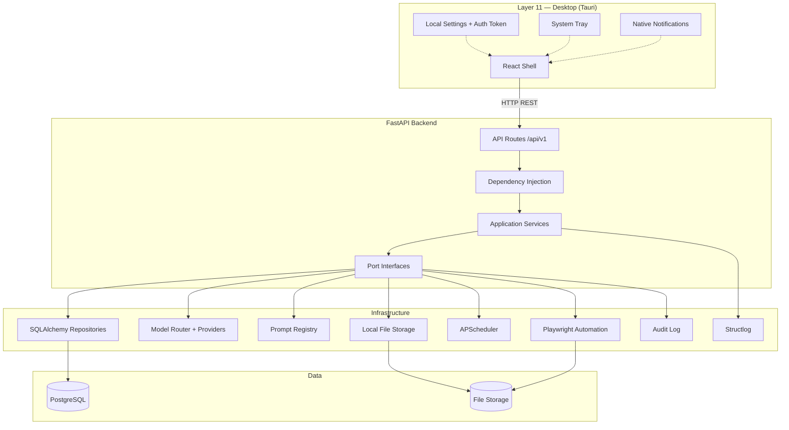
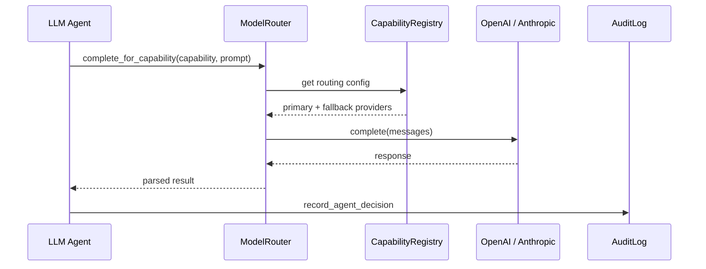
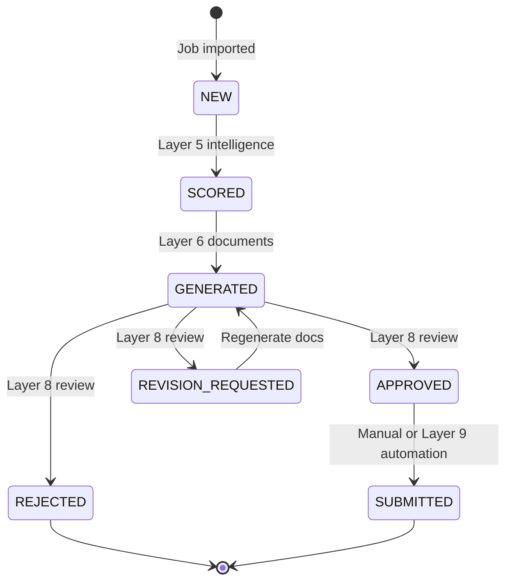
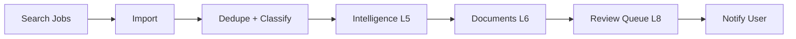
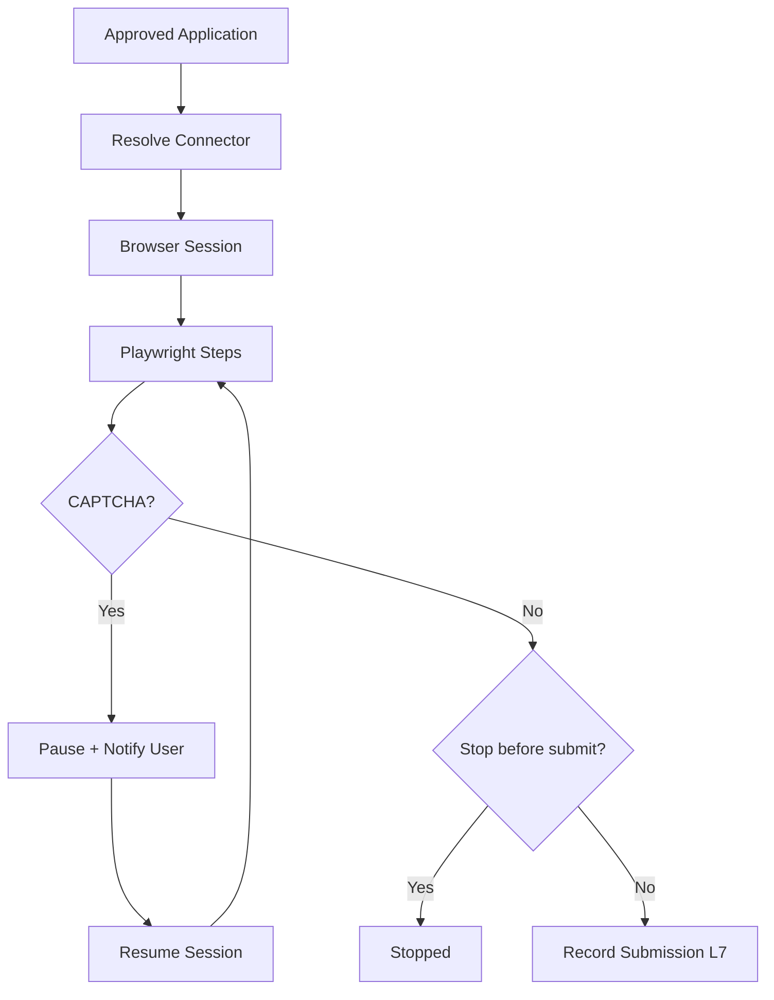

# Career OS V1 — Architecture

---

## System Overview



---

## Hexagonal Layers

```
┌─────────────────────────────────────────────────────────┐
│  API (FastAPI routes + Pydantic schemas)                │
├─────────────────────────────────────────────────────────┤
│  Application Services (orchestration, LangGraph)      │
│    job_service, job_intelligence_service,                 │
│    document_generation_service, review_queue_service,     │
│    application_automation_service, scheduler_pipeline     │
├─────────────────────────────────────────────────────────┤
│  Ports (abstract interfaces)                            │
├─────────────────────────────────────────────────────────┤
│  Infrastructure (adapters)                              │
│    repositories, AI providers, browser, prompts, audit    │
├─────────────────────────────────────────────────────────┤
│  Domain (enums, presets, constants)                       │
└─────────────────────────────────────────────────────────┘
```

---

## AI Request Flow



**Rule:** Application services never import provider SDKs directly.

---

## Job Application Lifecycle



---

## Morning Pipeline (Layer 10)



Triggered by: APScheduler cron, manual API, or scoped runs (source/company/job).

---

## Browser Automation (Layer 9)



Connectors: `job_bank_canada`, `workpei`, `indeed`, `company_career_pages` (YAML-driven).

---

## Desktop Architecture (Layer 11)

The desktop app is intentionally thin:

- **Stores locally:** backend URL, preferences, JWT
- **Polls:** scheduler notifications → native Windows toasts
- **Displays:** health, review stats, recent notifications
- **Triggers:** manual pipeline run via API
- **Does not:** duplicate business logic or embed the backend

---

## Key Design Decisions

| Decision | Rationale |
|----------|-----------|
| Single-user default | Personal career OS for one job seeker |
| Capability-based AI routing | Swap models per task without code changes |
| Prompt file + DB versioning | Git-friendly prompts with runtime active version |
| Manual submission default | User control over job applications |
| Config-driven job search | Scrapers deferred; pipeline testable via config |
| Tauri over Electron | Smaller footprint for Windows desktop shell |
| Production validation | `ENVIRONMENT=production` rejects insecure defaults at startup |
| Operational CLI | `career-os` for migrate, backup, restore, health outside the API |
